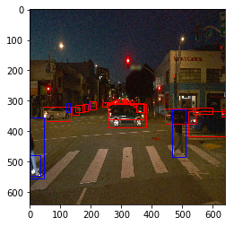
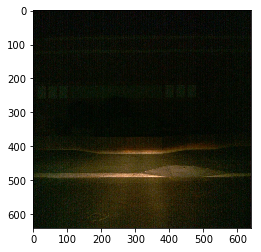
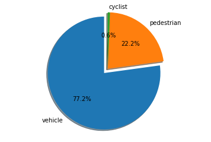
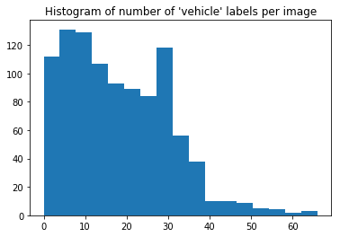
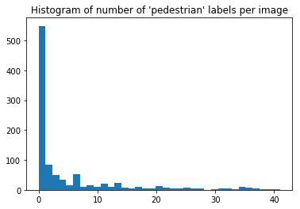
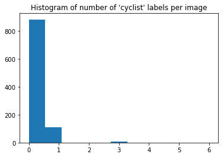
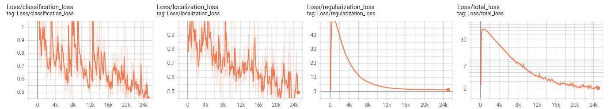
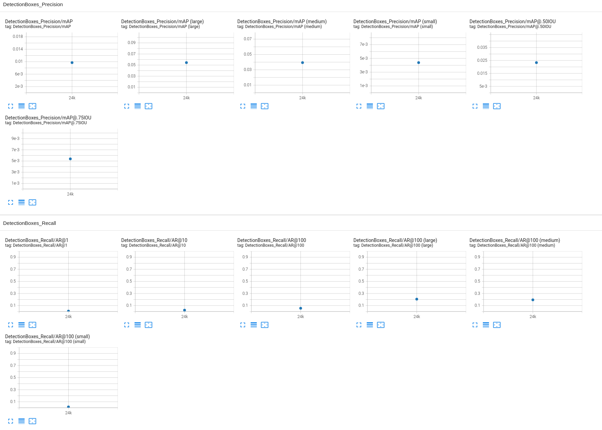
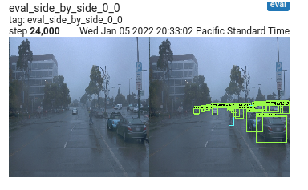
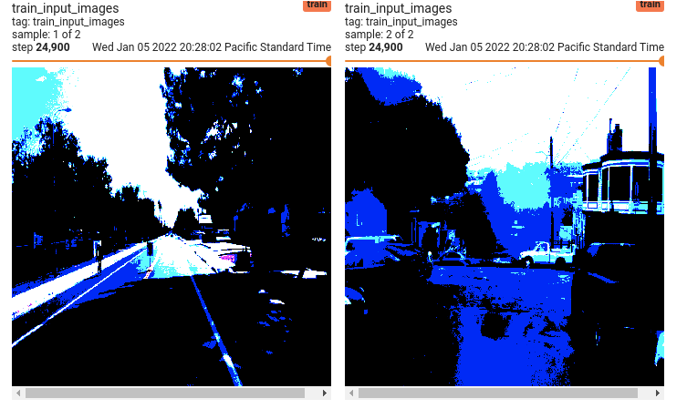

# Submission - Object Detection in an Urban Environment

## Project overview

The goal of this project is to create a framework that can detect and classify pedestrians, cyclists, and vehicles in visual imagery of real-life on-road scenarios. The visual images come from vehicle-mounted cameras on self driving cars.

The primary use case for this system is autonomous (self driving) cars. These vehicles need to have an accurate understanding of their environment in order to operate safely and avoid collisions. In urban environments, cyclists, pedestrians, and other vehicles are among the most common objects encountered on roads, so it is clearly important to be able to detect them. Additionally, it is important to _classify_ each of these objects, since they move and behave in very different ways.

Besides autonomous driving, one can also imagine other applications where this framework might be useful either by itself or as part of a more complex system:

- As a tool to supplement human drivers in avoiding collisions (e.g. as part of an Advanced Driver-Assistance System)
- Data collection for urban planning. For example, how many cyclists pass through a given intersection over the course of a typical week?
- Any other use case where an understanding of road users is important.

## Setup

### Retrieve the data

Note: These steps should be performed on the host machine (i.e. not in a Docker container)

Rather than using `download_process.py` to download the raw tfrecords and isolate the camera data (which will take a very long time), we'll instead just download the pre-processed data directly from the Udacity Project Workspace for this project. Open the project workspace in a browser and navigate to `/home/workspace` in the left window (should already be there). Right click on `data` and click `Download`. This will download a file called `data.tar.gz` to your `~/Downloads` folder.

Then, on your local machine: From the root of this repo, run `tar -xvf ~/Downloads/data.tar.gz` to extract the data into the workspace. The data will be extracted with the same directory structure as in the project workspace.

You'll also need to download the [pre-trained model](http://download.tensorflow.org/models/object_detection/tf2/20200711/ssd_resnet50_v1_fpn_640x640_coco17_tpu-8.tar.gz). Once you've downloaded it to your `~/Downloads` folder, then run the following from the root of this repo:

```bash
mkdir -p experiments/pretrained_model
cd experiments/pretrained_model
tar -xvf ~/Downloads/ssd_resnet50_v1_fpn_640x640_coco17_tpu-8.tar.gz 
```

### Running the submitted code

The notebooks and other code in this submission can be run inside the supplied Docker container. Follow provided instructions in the `build` directory to build and run the Docker container.

Note that when trying to run the "Exploratory Data Analysis" notebook in the Docker container, I encountered an error `AttributeError: module 'pyparsing' has no attribute 'downcaseTokens'`. It appears that the latest pyparsing module is too new (`downcaseTokens` was changed to `downcase_tokens` in version 3.0.0). To remedy this, simply install an older version by running `pip install pyparsing==2.4.2`.

In addition, the evaluation process may fail with error `TypeError: 'numpy.float64' object cannot be interpreted as an integer`. If so, then we need to use an older version of numpy. Install it with `pip install numpy==1.17.5`.

To run the config edit step, use the following from the root of the repo:

```bash
python edit_config.py --train_dir /app/project/data/waymo/train/ --eval_dir /app/project/data/waymo/val/ --batch_size 2 --checkpoint /app/project/experiments/pretrained_model/ssd_resnet50_v1_fpn_640x640_coco17_tpu-8/checkpoint/ckpt-0 --label_map /app/project/experiments/label_map.pbtxt
mkdir -p experiments/reference
mv pipeline_new.config experiments/reference
```

## Dataset

### Dataset analysis

The dataset contains camera images from urban scenes, taken with on-vehicle cameras. There are ~100 tfrecord files, each containing many images.

#### Sample image

A sample image from the dataset (with ground truth labels) is shown below. To see more sample images, run the `Exploratory Data Analysis.ipynb` notebook.



#### Observations about the images

It appears that the images are all looking forward, so perhaps they all use the front camera on the vehicle.

Also, some images appear to be very blurry / contain odd artifacts. An example is given below. This image did not contain any labels.



#### Distribution of labels

There are 3 label types, namely vehicles, pedestrians, and cyclists. These labels are not evenly distributed throughout the dataset. In fact, there are many more vehicles in the dataset than pedestrians, and many more pedestrians than cyclists. The following pie chart shows the distribution of labels for 1000 images randomly drawn from the dataset:



The fact that there are very few cyclists, for example, may cause us to have less confidence in our model's ability to detect cyclists.

Another useful data metric is the number of each label type present in images. The following histograms show the number of instances of each label per image for 1000 randomly chosen images in the dataset.







From the histograms, it is clear to see that most images contain vehicles, and in fact multiple vehicles. However, most images do not contain pedestrians or cyclists. Very few images contain large numbers of pedestrians, and only a handful of images contain multiple cyclists. It may prove useful to keep this in mind as we continue with training our model.

### Cross validation

We will use an 80/20 split between training and validation. This is a fairly common ratio and a good place to start. The splitting of the dataset is performed in the `create_splits.py` python script.

## Training

### Reference experiment

The reference experiment took about 1.25 hrs to finish on my desktop linux machine. Looking at the loss over time, it appears that the total_loss initially increased, then decreased substantially before roughly plateauing near ~2.1.



Taking a look at the precision and recall, all values were almost 0, meaning our model does not perform well at all.



So either something went wrong during the training, or the model is simply not very good at detecting objects. Taking a look at the side-by-side images, no objects are detected at all:



Something odd to note is that the train_input_images in tensorboard appear very oversaturated. I wonder if this is at the root of the poor performance?



In any case, this was a disappointing result. There were many errors / python package issues that occurred while trying to train this model, and many workarounds needed to be used, so perhaps this is part of the problem. The supplied Dockerfile and README instructions unfortunately did not work out of the box.
